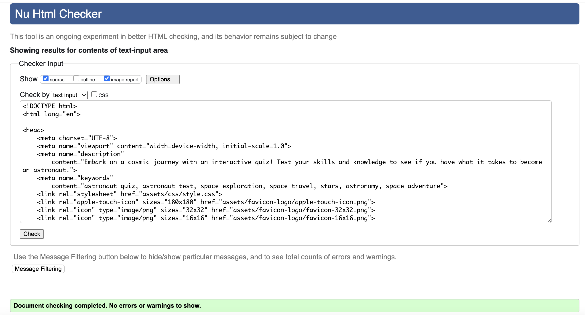
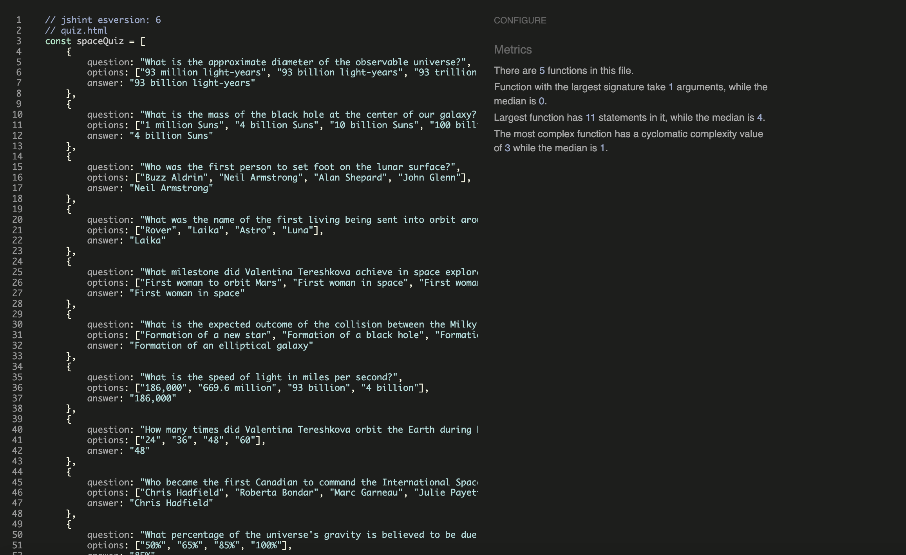
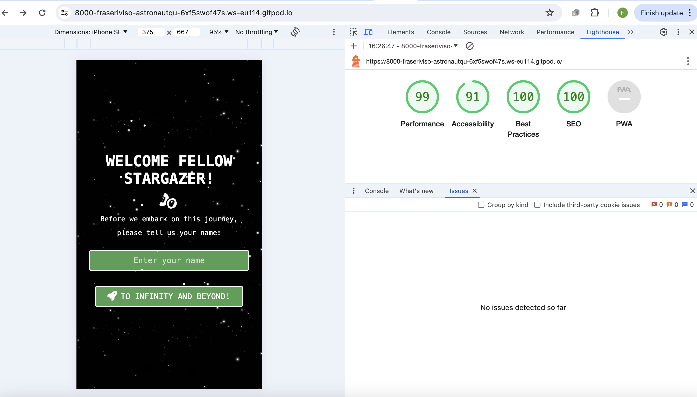

# So You Want To Be An Astronaut?

## Overview
*So You Want To Be An Astronaut?* is an interactive and educational website designed to ignite curiosity about space exploration and take you on a journey to see if you've got what it takes to become an astronaut. The website aims to engage users in learning about various aspects of space and then give the user an opportunity to test their knowledge at the end through an interactive quiz.

# Table of contents
- [User Experience (UX)](#ux)
    - [External User’s Goal](#external-users-goal)
    - [Site Owner's Goal](#site-owners-goal)
    - [Structure](#structure)
    - [Surface](#surface)
- [Features](#features)
- [Features Left to Implement](#features-left-to-implement)
- [Technologies Used](#technologies-used)
- [Testing](#testing)
    - [Validator Testing](#validator-testing)
    - [Performance](#performance)
    - [Bugs](#bugs)
- [Deployment](#deployment)
- [Credits](#credits)

# User Experience (UX)

## External User’s Goal

This website is for space enthusiasts who wanted to engage in an enjoyable and stimulating experience centered around space exploration. They will seek to test their knowledge, learn fascinating facts about the universe, and possibly even discover new interests within the realm of astronomy and space science.

## Site Owner's Goal
The goal of the site is to provide a captivating and enriching platform that entertains and educates users about space exploration. Through an engaging quiz and interactive content, the owner aims to create an immersive experience that sparks curiosity and fosters a passion for astronomy and space science.

## Structure
Balsamiq wireframes was used as a tool for meticulously planning out the mobile and desktop layout of a project. With its intuitive interface and wide array of pre-designed components, ideas were swiftly sketched out and visualized. By creating wireframes for both mobile and desktop layouts, teams can ensure a cohesive and user-friendly design across various screen sizes and devices. Balsamiq's simplicity enables quick iterations, allowing stakeholders to provide feedback early in the design process and iterate rapidly. Moreover, the low-fidelity nature of Balsamiq wireframes encourages a focus on functionality and user flow rather than intricate design details, fostering efficient communication and collaboration among team members. Overall, leveraging Balsamiq wireframes streamlines the design process, fosters collaboration, and ultimately leads to the creation of more polished and user-centric digital experiences.

## Surface

### Colours
Main colours:
* background color: #000
* font color: white;
* button: #4CAF50;
* navigation bar: rgba(51, 51, 51, 0.9);

### Fonts 
Main fonts:
* font-family: 'Space Mono', monospace;
* font-family: 'Trebuchet MS', sans-serif;

## Features

### Intro
The introduction page, index.html, serves as the gateway to a personalised digital experience by inviting users to input their names. This simple yet crucial interaction sets the stage for a more tailored journey throughout the website. By capturing the user's name, the website can dynamically personalise content adding a warm and welcoming touch to the overall experience. The introduction page not only collects user information but also sets the tone for a personalised and user-centric experience.

### Navigation Bar
The navigation bar plays a pivotal role in enhancing user experience by providing seamless access to different sections of the page, home.html. With its intuitive design, users can effortlessly navigate through the content by simply clicking on the desired section in the navigation menu. What makes this navigation bar particularly user-friendly is its ability to stay fixed at the top of the page as the user scrolls down. This ensures that regardless of where the user is on the page, the navigation options remain readily accessible, eliminating the need for excessive scrolling or searching. By facilitating quick jumps to different sections, the navigation bar streamlines the browsing experience, allowing users to explore the website's content with ease and efficiency. 

### Fun Facts
The facts section of the website gives the user some great information about the wonders of the universe, enriched with visually engaging images that bring each fact to life. Combining intriguing insights with stunning visuals, this section offers a multimedia experience that captivates and educates visitors. Each fact is accompanied by an illustrative image, providing a vivid depiction of the cosmic wonders being discussed.

### History
The human history of space section on the website offers a compelling narrative of humanity's ambitious quest to explore the cosmos. Through text and imagery, visitors are transported back in time to witness the triumphs and challenges of humanity's journey beyond the confines of our planet.

### Hall of Fame
The Hall of Fame section on the website pays tribute to the iconic figures who have transcended the bounds of Earth's atmosphere. As users navigate through this virtual gallery of space pioneers, they are reminded of the profound impact of these visionaries on our collective understanding of the cosmos and the enduring legacy they leave for future generations.

### Quiz
At the bottom of the home page (home.html) there is a button which leads to an engaging and interactive quiz, inviting users to put their newfound knowledge to the test. Drawing from the information provided throughout the page, the quiz offers a series of thought-provoking questions that challenge users to recall key facts and insights about space exploration. Encouraging careful reading and comprehension, each question serves as a gateway to deeper understanding and exploration. As users navigate through the quiz, their answers are recorded, culminating in a final score that reflects their comprehension and retention of the material. Depending on their performance (7/10 or more is a pass, anything less they will have to try again), users are presented with tailored outcomes, guiding them towards further engagement with the site. Whether it's progressing to an "application" page to explore opportunities in space exploration or revisiting the home page to reinforce their understanding, the quiz offers an immersive and rewarding experience for users eager to embark on a cosmic journey.

## Features Left to Implement

### Timeline of the History of the Universe
A feature that could enrich the user experience down the line is a "Timeline of the History of the Universe." This feature aims to provide users with a dynamic and visually captivating overview of key milestones in the cosmic journey, from the Big Bang to the present day. Functionality-wise, the timeline would be interactive, allowing users to explore significant events through clickable markers or scrolling. Each marker on the timeline would represent a pivotal moment in cosmic history, accompanied by engaging multimedia content such as images, videos, and descriptive text. Users can navigate the timeline at their own pace, gaining a deeper understanding of the unfolding story of the universe. This feature not only educates users about the scientific narrative of cosmic evolution but also immerses them in a fascinating journey through time and space.

## Technologies Used

### HTML 5 and CSS
HTML5 and CSS are utilised extensively to create a visually engaging and interactive website. HTML5 is employed to structure the content, with semantic elements like header, nav, main and section, organising the layout effectively. These elements provide clarity and improve accessibility for both users and search engines.

CSS is employed to style the HTML elements, ensuring a cohesive and aesthetically pleasing presentation across the website. Stylesheets define the color scheme, typography, spacing, and layout, creating a consistent visual identity. Advanced CSS features like flexbox and grid layout are used to achieve responsive design, allowing the website to adapt seamlessly to different screen sizes and orientations.

Additionally, CSS animations and transitions are applied to enhance user experience and add subtle visual cues. Media queries are utilised to implement responsive design, optimising the layout for various devices and screen resolutions. 

Overall, HTML5 and CSS are fundamental tools in this project, facilitating the creation of a well-structured, visually appealing, and responsive website that effectively communicates its content and engages users.

### Javascript
JavaScript played a pivotal role in enhancing the website's interactivity and facilitating decision-making processes. Through JavaScript, interactive features such as the quiz, dynamic content loading, and user input validation were implemented and decision-making logic was integrated to personalise the user experience based on input data. Additionally, JavaScript enabled the creation of responsive designs, ensuring the website adapts seamlessly to different screen sizes and device types. Overall, JavaScript's versatility and functionality were instrumental in elevating the user experience and adding depth to the website's interactive elements.

### Google Fonts
Google Fonts provides a vast library of free and open-source fonts that can be easily integrated into web projects. In this website, Google Fonts were used to enhance typographic choices and elevate the visual appeal of the content. By selecting appropriate fonts that complement the overall design aesthetic, Google Fonts contribute to creating a cohesive and professional-looking website. The chosen fonts not only improve readability but also add personality and style to the text, helping to convey the intended message effectively. Leveraging Google Fonts also ensures cross-platform compatibility and fast loading times, enhancing the user experience across different devices and browsers.

### Font Awesome
Font Awesome offers a comprehensive collection of scalable vector icons that can be seamlessly incorporated into web projects. In this website, Font Awesome icons were employed to enhance visual elements and provide intuitive cues for user interactions. These icons not only enhance the aesthetic appeal of the website but also improve usability by making it easier for users to navigate and understand the content.

### Balsamiq Wireframes
Balsamiq wireframes served as a crucial planning tool for designing the mobile and desktop layouts of this project. Leveraging Balsamiq's intuitive interface, wireframes were created to visualise the website's structure, navigation flow, and content placement across different screen sizes. By sketching out wireframes, it became easier to iterate and refine the design, ensuring a user-friendly experience on both mobile devices and desktop browsers.

### Gitpod and Github:
Gitpod and GitHub were instrumental in the development and collaboration process of this project. Gitpod provided a cloud-based integrated development environment (IDE) that enabled work to be done on the codebase from anywhere with an internet connection. With Gitpod's pre-configured development environments, setting up the project was quick and hassle-free, allowing developers to focus on writing code rather than configuring their development environment. Additionally, Gitpod's collaboration features, such as real-time editing and sharing workspaces, facilitated smooth collaboration among team members, enabling them to work together on the same codebase simultaneously.

GitHub, on the other hand, served as the central repository for the project, hosting the codebase and version control system. Leveraging GitHub's version control capabilities, developers were able to track changes, manage revisions, and coordinate contributions from multiple collaborators seamlessly. The use of branches, pull requests, and code reviews facilitated a structured development workflow, ensuring that changes were reviewed and integrated into the codebase efficiently. Moreover, GitHub's issue tracking system enabled developers to report bugs, suggest features, and manage tasks effectively, fostering a transparent and organized development process. Overall, Gitpod and GitHub provided a robust and efficient platform for developing, collaborating, and managing the project, contributing to its successful execution and delivery.

### Lighthouse
Lighthouse testing on Google Chrome played a crucial role in ensuring the performance, accessibility, and overall quality of the project. By running Lighthouse audits directly within the Chrome browser, developers were able to assess various aspects of the website, including performance metrics such as page load speed, accessibility features to ensure the site was usable by all users, best practices for web development standards, and search engine optimization (SEO) factors.

## Testing
Throughout the development process, rigorous testing was conducted to ensure the website's functionality remained intact across various stages and scenarios. A comprehensive approach was adopted, encompassing both manual and automated testing methodologies.

Initial testing focused on individual components and features, verifying that each element performed as expected. As changes were made to the codebase, frequent regression testing was carried out to identify and address any unintended side effects or regressions introduced by new modifications.

To ensure compatibility with different screen sizes and devices, responsive design testing was performed using emulators, simulators, and real devices. This involved testing the website on devices with varying screen resolutions, including smartphones, tablets, laptops, and desktop computers.

JavaScript functionality underwent continuous testing to guarantee smooth operation and optimal user experience. This involved testing user interactions, form submissions, dynamic content updates, and other JavaScript-driven features across different browsers and environments.

During testing, several issues were identified, ranging from layout inconsistencies on certain devices to unexpected behavior in JavaScript functions. These issues were logged, prioritized, and addressed promptly by the development team.

For layout inconsistencies, adjustments were made to CSS stylesheets to ensure consistent rendering across all devices. JavaScript issues were debugged and fixed by tracing the source of the problem and implementing appropriate solutions, such as refining logic or optimizing code execution.

Additionally, automated testing scripts were implemented using testing frameworks to streamline the testing process and ensure consistent behavior across different environments. These scripts helped identify potential issues early in the development cycle, enabling faster resolution and reducing the likelihood of regressions in subsequent iterations.

Overall, the testing phase played a crucial role in delivering a high-quality, robust website that meets the needs of users across various devices and environments. It allowed for thorough validation of features, identification of potential issues, and iterative refinement to achieve optimal performance and user satisfaction.

### Validator Testing

### HTML:

### CSS:

### Javascript:

## Performance

### Desktop:

### Mobile:

## Bugs

## Deployment

## Credits

### Content:
Info is taken from chat gpt

Space facts directly from: https://www.buzzfeed.com/audreyworboys/space-facts

### Media:

Favicon in tab (https://favicon.io/emoji-favicons/rocket/)

Google images 

### Extra Help:

### Code
[404.html Template](https://www.geeksforgeeks.org/create-a-404-page-using-html-and-css/)

[Space Background on index.html and quiz.html](https://codepen.io/wheresdara/pen/wvXBpwa)

[Background Image](https://www.youtube.com/watch?v=_oFWg_NlKdo)

### Styling and Media 

[Back to TOP](#table-of-contents)
          
